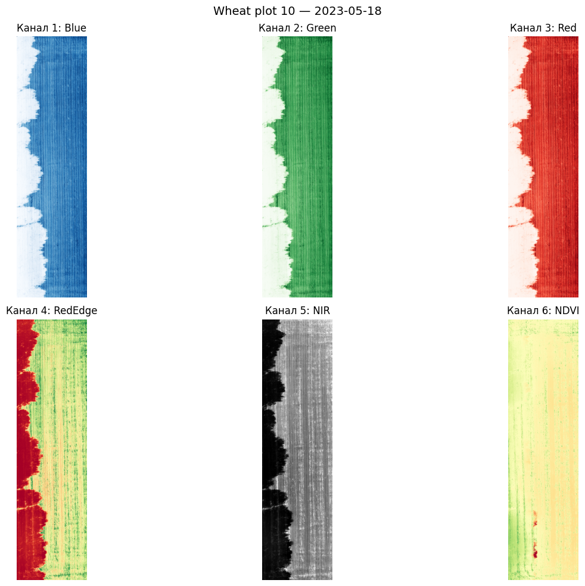
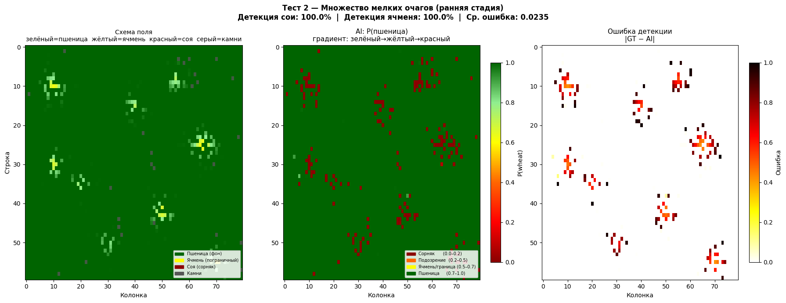

# Stage 2 results and their limits

All numbers come from `notebooks/stage2_resnet18_wheat_classifier.ipynb` (Colab, Tesla T4, June 2026).

## Data

- Source: [Zenodo 7860751](https://zenodo.org/records/7860751), *A multispectral UAV imagery dataset of wheat, soybean, and barley crops in East Kazakhstan* (Maulit et al., CC BY 4.0; paper: *Data* 2023, 8(5), 88, [doi:10.3390/data8050088](https://doi.org/10.3390/data8050088)). DJI Phantom 4 Multispectral, 2022 season, 27 one-hectare plots, 5 flights. Each processed GeoTIFF has 6 bands: Blue, Green, Red, RedEdge, NIR, NDVI.
- Tiles: 64×64 px (~2×2 m at ~3 cm GSD), filtered by `is_valid_tile` (empty, low-NDVI and saturated tiles removed).
- Classes: **1 = wheat, 0 = soybean** (labelled "non-wheat" in code). 15,000 tiles each.
  - Wheat tiles come from 8 images: plots 10, 11, 12, 22, 23, 25 (2 dates), 26.
  - Soybean tiles come from 8 images in folders 19, 20 and 21. The files in folder 21 are named `20_*`, so folder 21 may duplicate plot 20. This was not checked.
- Barley was not used for training.

## Training

ResNet18, ImageNet weights, first conv widened to 6 channels, 11,186,946 parameters. Cross-entropy loss, Adam (lr 1e-4, halved every 5 epochs by StepLR), batch 64, 15 epochs, random 80/20 split of the 30,000 tiles (24,000 / 6,000).

| Epoch | Train acc | Val acc |
|---|---|---|
| 1 | 97.90% | 99.52% |
| 9 (best, saved) | 100.00% | **99.75%** |
| 15 | 100.00% | 99.67% |

**Limit:** the split is random at tile level. Neighbouring tiles from the same image, date and plot sit in both train and val, so 99.75% measures how well the model separates these two crops *within these images*, not how it generalizes to new fields.

## Held-out plot (closest thing to a real test)

Wheat plot 13, flight 06-08, was never used for training. Whole-image inference:

- 89 × 23 grid, 2,002 valid tiles
- 1,941 tiles (97.0%) classified as wheat, 61 (3.0%) as non-wheat

The plot is pure wheat, so the 3.0% are false alarms. The figure below labels them "weed", but they are misclassified wheat tiles.

This is still the same field, season and camera, so it is not an independent location test.

## Synthetic field maps

Cells 10 and 14–16 build 60×80-tile "fields" from real tiles: wheat as background, soybean (and in cells 15–16, barley) pasted in as "infestation" patches of different shapes. A soybean tile counts as detected if P(wheat) < 0.4, a barley tile if P(wheat) < 0.65. "Error" is the mean |ground truth − prediction| against a graded synthetic ground truth.

| Scenario | Soybean detected | Barley detected | Mean error |
|---|---|---|---|
| 1 — one large patch | 100% | 100% | 0.0238 |
| 2 — many small patches | 100% | 100% | 0.0235 |
| 3 — stripes along rows | 100% | 100% | 0.1508 |
| 4 — edge infestation | 100% | 100% | 0.0314 |
| 5 — diagonal wind drift | 100% | 100% | 0.0184 |
| 6 — chaotic | 100% | 100% | 0.0476 |

**Limits:**
- Wheat and soybean tiles are drawn from `tiles_balanced`, the training pool. About 80% of them were trained on, so these are not independent tests.
- Barley was never seen in training, so "barley is not wheat" is the one genuinely unseen check. It is still the same field and flights.
- Cell 16 renames soybean to "weed (strong)" and barley to "weed (weak/borderline)". **No weed imagery was used anywhere.** These maps show the pipeline, not weed detection.

## Out-of-distribution behaviour

The classifier has only two outputs and no "unknown" class. A smoke test on random 6-band noise (`scripts/predict_field.py` on a synthetic GeoTIFF) returned P(wheat) = 1.0 for every tile. Inputs unlike the training data therefore produce confident, meaningless answers.

## What would make the result meaningful

1. Split by plot (or by date) instead of by tile, and report per-plot accuracy.
2. Add an explicit test on plots and dates never used for training.
3. Replace soybean with the real target classes (weeds, diseased wheat) from target fields, labelled by an agronomist.
4. Collect imagery with the team's own drone and cameras. The model expects 5 calibrated multispectral bands plus NDVI, which a NoIR camera does not produce (see [hardware.md](hardware.md)).
